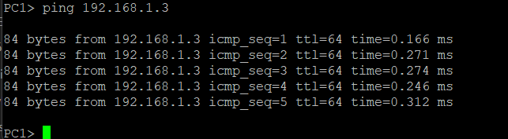
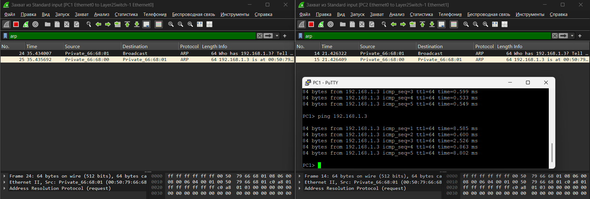

## Коммутатор
### Создать простейшую сеть, состоящую из 1 коммутатора и 2 компьютеров, назначить им произвольные ip адреса из одной сети

Сначала на схему были помещены два VPCS и один коммутатор . 


После входа в консоль были назначены IP адреса для VPSC.
PC 1 - 192.168.1.2/24
PC 2 - 192.168.1.3/24
Для установки IP адреса использовалась команда ```ip 192.168.1.x```.
### Запустить симуляцию, выполнить команду ping с одного из компьютеров, используя ip адрес второго компьютера

Для проверки соединения использовалась команда ```ping 192.168.1.3``` на PC 1.


Перехват arp-трафика:


### Cодержимое пакетов
1. Пакет №24 : 


# Часть 2 - Маршрутизатор, ping, два компа
switch by Гай Ричи
## Маршрутизатор

### Настройка IP адресов компьютеров
На компьютерах PC3, PC4 были настроены ip адреса командой `ip <ip_addr> <mask>`.
PC3 : `ip 192.168.1.5 255.255.255.0 192.168.1.1`
PC4:  `ip 192.168.2.3 255.255.255.0 192.168.2.1`
### Первоначальная настройка маршрутизатора


Сначала были настроены пароли для telnet и vty.
Для telnet был поставлен пароль pav_pass, для всех vty pav_pass1.
```
R1#enable
R1#conf t
Enter configuration commands, one per line.  End with CNTL/Z.
R1(config)#enable secret cisco
R1(config)#line console 0
R1(config-line)#password pav_pass
R1(config-line)#login
R1(config-line)#exit
R1(config)#line vty 0 15
R1(config-line)#password pav_pass1
R1(config-line)#login
R1(config-line)#exit
R1(config)#exit
R1#
*Mar  1 00:03:10.095: %SYS-5-CONFIG_I: Configured from console by console
R1#write
Building configuration...
[OK]
R1#
```

Далее на маршрутизаторе были настроены ip адреса для интерфейсов:
```
R1(config)#int f0/0
R1(config-if)#ip address 192.168.1.1 255.255.255.0
R1(config-if)#no shutdown
R1(config-if)#exit
R1(config)#
*Mar  1 00:18:59.423: %LINK-3-UPDOWN: Interface FastEthernet0/0, changed state to up
*Mar  1 00:19:00.423: %LINEPROTO-5-UPDOWN: Line protocol on Interface FastEthernet0/0, changed state to up
R1(config)#int f1/0
R1(config-if)#ip ad 192.168.2.1 255.255.255.0
R1(config-if)#no shutdown
R1(config-if)#exit
R1(config)#
*Mar  1 00:19:59.319: %LINK-3-UPDOWN: Interface FastEthernet1/0, changed state to up
*Mar  1 00:20:00.319: %LINEPROTO-5-UPDOWN: Line protocol on Interface FastEthernet1/0, changed state to up
R1(config)#do wr
Building configuration...
[OK]
R1(config)#
```

Итого получилась такая схема подключений:
R.fastEthernet0/0 <-> PC3
R.fastEthernet1/0 <-> PC4

| Device | IP          | Mask          |
| ------ | ----------- | ------------- |
| R.F0\0 | 192.168.1.1 | 255.255.255.0 |
| R.F1\0 | 192.168.2.1 | 255.255.255.0 |
| PC3    | 192.168.1.5 | 255.255.255.0 |
| PC4    | 192.168.2.3 | 255.255.255.0 |
### Проверка соединения
Результаты ping на PC3:
```
PC3> ping 192.168.2.3

192.168.2.3 icmp_seq=1 timeout
84 bytes from 192.168.2.3 icmp_seq=2 ttl=63 time=11.112 ms
84 bytes from 192.168.2.3 icmp_seq=3 ttl=63 time=15.285 ms
84 bytes from 192.168.2.3 icmp_seq=4 ttl=63 time=15.400 ms
84 bytes from 192.168.2.3 icmp_seq=5 ttl=63 time=15.481 ms

PC3> ping 192.168.2.3

84 bytes from 192.168.2.3 icmp_seq=1 ttl=63 time=19.056 ms
84 bytes from 192.168.2.3 icmp_seq=2 ttl=63 time=16.022 ms
84 bytes from 192.168.2.3 icmp_seq=3 ttl=63 time=15.000 ms
84 bytes from 192.168.2.3 icmp_seq=4 ttl=63 time=15.149 ms
84 bytes from 192.168.2.3 icmp_seq=5 ttl=63 time=15.185 ms
```

Результаты ping на PC4:
```
PC4> ping 192.168.1.5

84 bytes from 192.168.1.5 icmp_seq=1 ttl=63 time=12.158 ms
84 bytes from 192.168.1.5 icmp_seq=2 ttl=63 time=15.281 ms
84 bytes from 192.168.1.5 icmp_seq=3 ttl=63 time=15.335 ms
84 bytes from 192.168.1.5 icmp_seq=4 ttl=63 time=15.634 ms
84 bytes from 192.168.1.5 icmp_seq=5 ttl=63 time=15.707 ms

PC4>
```

### Перехваченные пакеты
Перехваченные пакеты ICMP:


Перехваченные пакеты ARP:


Пример перехваченного пакета ICMP:


1. Differentiated Service Field - Данное поле используется для регулировки трафика в сетях. Поле содержит в себе DiffSer Code Point - метка 'приоритетности' пакета. Может использоваться к примеру для уменьшения задержек при передаче голосовых или стриминговых данных.
2. Flags - Размер 3 бита.
1 бит: Зарезервирован, всегда 0.
2 бит: Don't Fragment - Поле обозначающее, фрагментирована ли дейтаграмма или нет.
3 бит: More Fragments - Для не фрагментированных пакетов флаг MF снят. Для фрагментированных пакетов флаг MF установлен для всех фрагментов, кроме последнего. Последний фрагмент имеет ненулевое значение смещения фрагмента (Fragment Offset), поэтому его все равно можно отличить от не фрагментированного пакета.