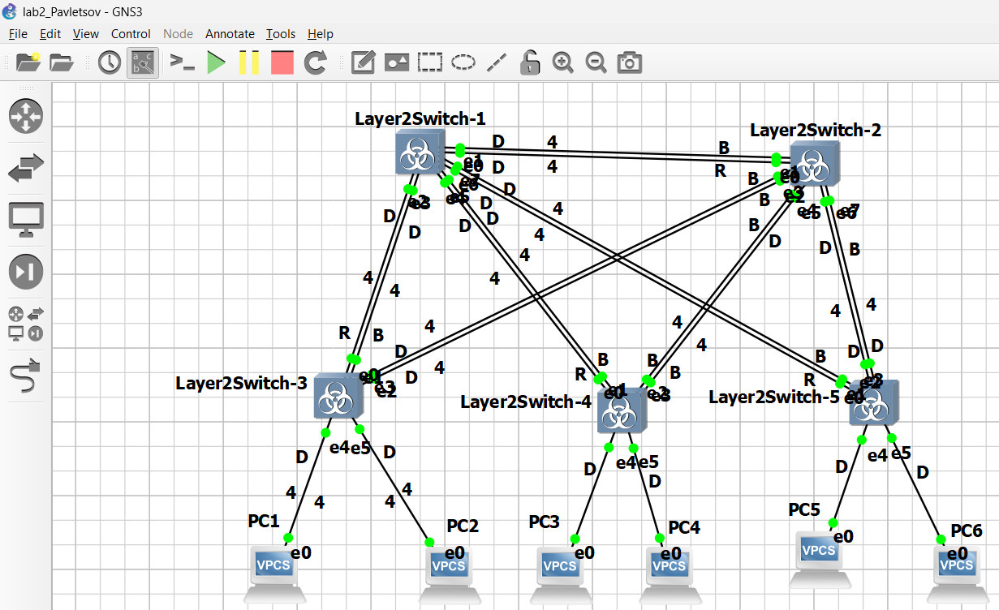
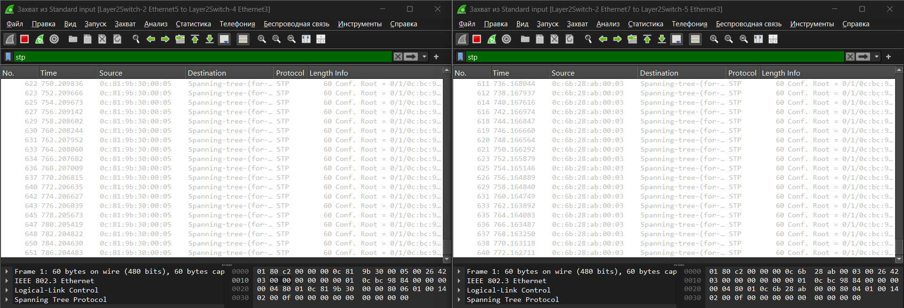
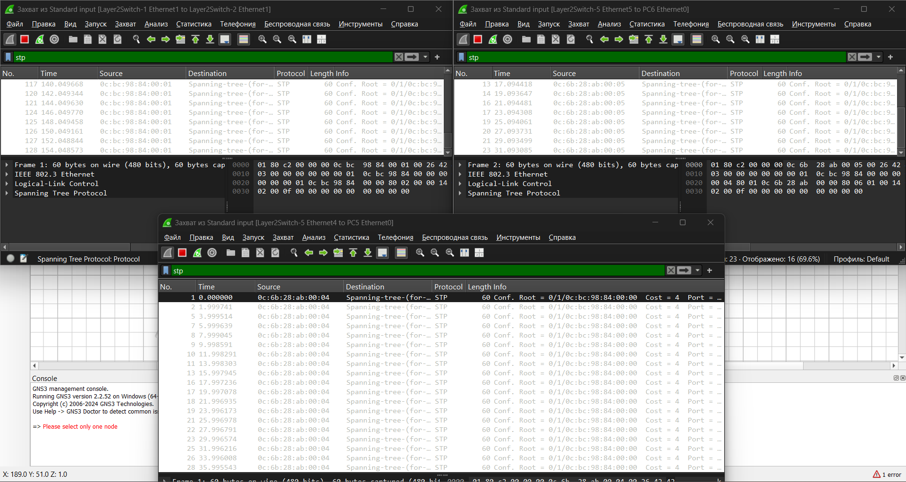
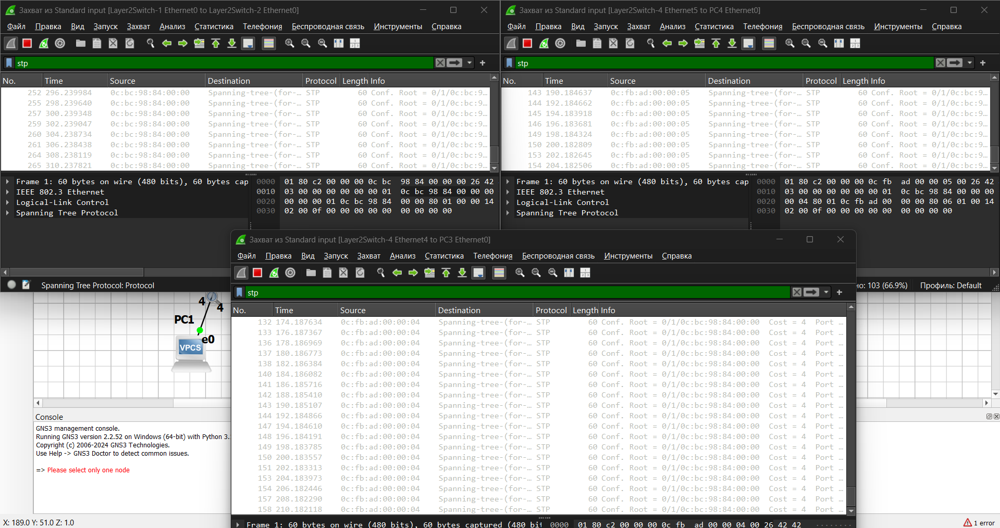
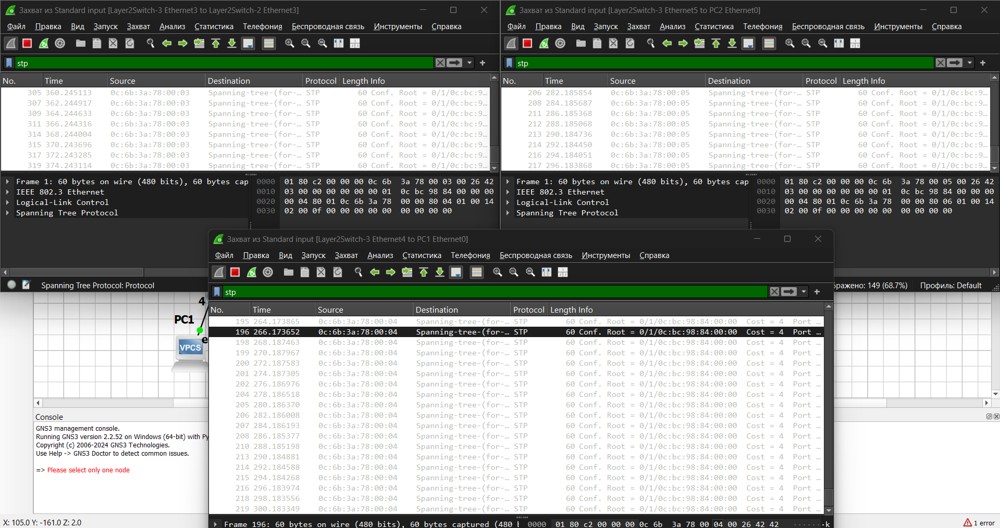
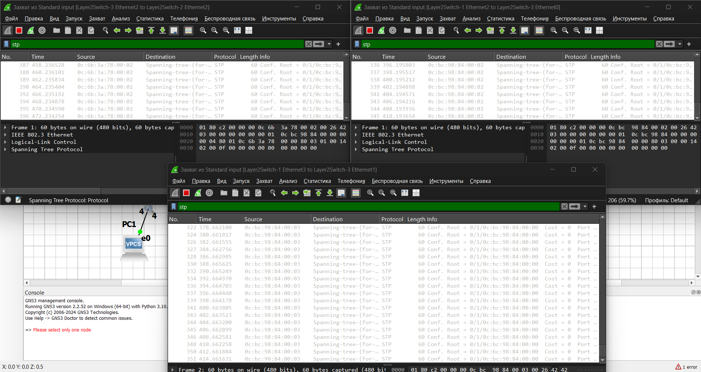
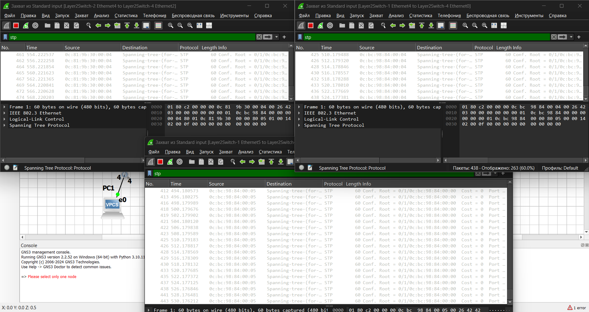
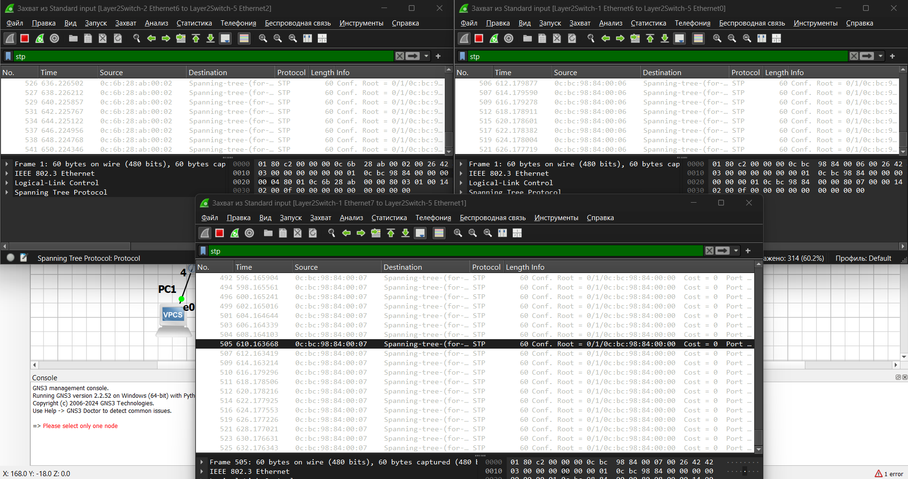
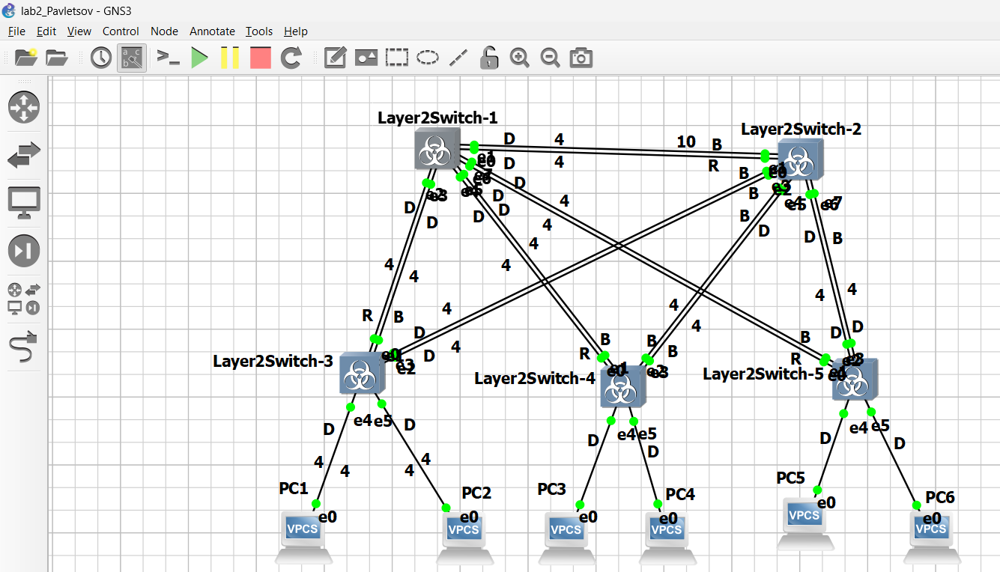

# Лабораторная работа №2

## Настройка STP на всех роутерах
Сначала коммутатор vIOS-L2-01 явно объявим корневым и настроим приоритет равным 0, чтоб явно указать что данный роутер является корневым.
```
vIOS-L2-01(config)#sp v 1 r p
vIOS-L2-01(config)#sp v 1 p 0
vIOS-L2-01(config)#do wr
Building configuration...
Compressed configuration from 5274 bytes to 2018 bytes[OK]
*Dec 10 15:17:00.363: %GRUB-5-CONFIG_WRITING: GRUB configuration is being updated on disk. Please wait...
*Dec 10 15:17:01.131: %GRUB-5-CONFIG_WRITTEN: GRUB configuration was written to disk successfully.
vIOS-L2-01(config)#do sh sp

VLAN0001
  Spanning tree enabled protocol ieee
  Root ID    Priority    1
             Address     0cbc.9884.0000
             This bridge is the root
             Hello Time   2 sec  Max Age 20 sec  Forward Delay 15 sec

  Bridge ID  Priority    1      (priority 0 sys-id-ext 1)
             Address     0cbc.9884.0000
             Hello Time   2 sec  Max Age 20 sec  Forward Delay 15 sec
             Aging Time  15  sec

Interface           Role Sts Cost      Prio.Nbr Type
------------------- ---- --- --------- -------- --------------------------------
Gi0/0               Desg FWD 4         128.1    Shr
Gi0/1               Desg FWD 4         128.2    Shr
Gi0/2               Desg FWD 4         128.3    Shr
Gi0/3               Desg FWD 4         128.4    Shr
Gi1/0               Desg FWD 4         128.5    Shr
Gi1/1               Desg FWD 4         128.6    Shr
Gi1/2               Desg FWD 4         128.7    Shr
Gi1/3               Desg FWD 4         128.8    Shr

vIOS-L2-01(config)#
```

Для проверки настроек посмотрим настройки spanning-tree на коммутаторе Layer2Switch-4:
```
sw4#sh sp

VLAN0001
  Spanning tree enabled protocol ieee
  Root ID    Priority    1
             Address     0cbc.9884.0000
             Cost        4
             Port        1 (GigabitEthernet0/0)
             Hello Time   2 sec  Max Age 20 sec  Forward Delay 15 sec

  Bridge ID  Priority    32769  (priority 32768 sys-id-ext 1)
             Address     0cfb.ad00.0000
             Hello Time   2 sec  Max Age 20 sec  Forward Delay 15 sec
             Aging Time  300 sec

Interface           Role Sts Cost      Prio.Nbr Type
------------------- ---- --- --------- -------- --------------------------------
Gi0/0               Root FWD 4         128.1    Shr
Gi0/1               Altn BLK 4         128.2    Shr
Gi0/2               Altn BLK 4         128.3    Shr
Gi0/3               Altn BLK 4         128.4    Shr
Gi1/0               Desg FWD 4         128.5    Shr
Gi1/1               Desg FWD 4         128.6    Shr


sw4#
```

## Проверка доступности ПК между собой
### PC1
```
PC1> ping 192.168.1.3

84 bytes from 192.168.1.3 icmp_seq=1 ttl=64 time=6.007 ms
84 bytes from 192.168.1.3 icmp_seq=2 ttl=64 time=1.491 ms
84 bytes from 192.168.1.3 icmp_seq=3 ttl=64 time=5.039 ms
84 bytes from 192.168.1.3 icmp_seq=4 ttl=64 time=7.643 ms
84 bytes from 192.168.1.3 icmp_seq=5 ttl=64 time=1.862 ms

PC1> ping 192.168.1.4

84 bytes from 192.168.1.4 icmp_seq=1 ttl=64 time=11.812 ms
84 bytes from 192.168.1.4 icmp_seq=2 ttl=64 time=17.578 ms
84 bytes from 192.168.1.4 icmp_seq=3 ttl=64 time=7.521 ms
84 bytes from 192.168.1.4 icmp_seq=4 ttl=64 time=5.009 ms
84 bytes from 192.168.1.4 icmp_seq=5 ttl=64 time=6.460 ms

PC1> ping 192.168.1.5

84 bytes from 192.168.1.5 icmp_seq=1 ttl=64 time=15.747 ms
84 bytes from 192.168.1.5 icmp_seq=2 ttl=64 time=6.851 ms
84 bytes from 192.168.1.5 icmp_seq=3 ttl=64 time=8.268 ms
84 bytes from 192.168.1.5 icmp_seq=4 ttl=64 time=16.500 ms
84 bytes from 192.168.1.5 icmp_seq=5 ttl=64 time=7.366 ms

PC1> ping 192.168.1.6

84 bytes from 192.168.1.6 icmp_seq=1 ttl=64 time=11.470 ms
84 bytes from 192.168.1.6 icmp_seq=2 ttl=64 time=7.909 ms
84 bytes from 192.168.1.6 icmp_seq=3 ttl=64 time=6.988 ms
84 bytes from 192.168.1.6 icmp_seq=4 ttl=64 time=3.456 ms
84 bytes from 192.168.1.6 icmp_seq=5 ttl=64 time=3.083 ms

PC1> ping 192.168.1.7

84 bytes from 192.168.1.7 icmp_seq=1 ttl=64 time=8.289 ms
84 bytes from 192.168.1.7 icmp_seq=2 ttl=64 time=7.612 ms
84 bytes from 192.168.1.7 icmp_seq=3 ttl=64 time=12.955 ms
84 bytes from 192.168.1.7 icmp_seq=4 ttl=64 time=7.782 ms
84 bytes from 192.168.1.7 icmp_seq=5 ttl=64 time=14.042 ms
```

### PC2
```
PC2> ping 192.168.1.4

84 bytes from 192.168.1.4 icmp_seq=1 ttl=64 time=5.273 ms
84 bytes from 192.168.1.4 icmp_seq=2 ttl=64 time=7.566 ms
84 bytes from 192.168.1.4 icmp_seq=3 ttl=64 time=7.032 ms
84 bytes from 192.168.1.4 icmp_seq=4 ttl=64 time=7.256 ms
84 bytes from 192.168.1.4 icmp_seq=5 ttl=64 time=7.367 ms

PC2> ping 192.168.1.5

84 bytes from 192.168.1.5 icmp_seq=1 ttl=64 time=9.805 ms
84 bytes from 192.168.1.5 icmp_seq=2 ttl=64 time=7.026 ms
84 bytes from 192.168.1.5 icmp_seq=3 ttl=64 time=7.368 ms
84 bytes from 192.168.1.5 icmp_seq=4 ttl=64 time=4.653 ms
84 bytes from 192.168.1.5 icmp_seq=5 ttl=64 time=11.911 ms

PC2> ping 192.168.1.6

84 bytes from 192.168.1.6 icmp_seq=1 ttl=64 time=6.473 ms
84 bytes from 192.168.1.6 icmp_seq=2 ttl=64 time=1.856 ms
84 bytes from 192.168.1.6 icmp_seq=3 ttl=64 time=8.826 ms
84 bytes from 192.168.1.6 icmp_seq=4 ttl=64 time=3.704 ms
84 bytes from 192.168.1.6 icmp_seq=5 ttl=64 time=10.620 ms

PC2> ping 192.168.1.7

84 bytes from 192.168.1.7 icmp_seq=1 ttl=64 time=5.253 ms
84 bytes from 192.168.1.7 icmp_seq=2 ttl=64 time=5.855 ms
84 bytes from 192.168.1.7 icmp_seq=3 ttl=64 time=6.578 ms
84 bytes from 192.168.1.7 icmp_seq=4 ttl=64 time=7.514 ms
84 bytes from 192.168.1.7 icmp_seq=5 ttl=64 time=8.129 ms
```

### PC3
```
PC3> ping 192.168.1.5

84 bytes from 192.168.1.5 icmp_seq=1 ttl=64 time=1.354 ms
84 bytes from 192.168.1.5 icmp_seq=2 ttl=64 time=4.757 ms
84 bytes from 192.168.1.5 icmp_seq=3 ttl=64 time=7.295 ms
84 bytes from 192.168.1.5 icmp_seq=4 ttl=64 time=0.872 ms
84 bytes from 192.168.1.5 icmp_seq=5 ttl=64 time=0.830 ms

PC3> ping 192.168.1.6

84 bytes from 192.168.1.6 icmp_seq=1 ttl=64 time=19.093 ms
84 bytes from 192.168.1.6 icmp_seq=2 ttl=64 time=4.065 ms
84 bytes from 192.168.1.6 icmp_seq=3 ttl=64 time=7.843 ms
84 bytes from 192.168.1.6 icmp_seq=4 ttl=64 time=4.725 ms
84 bytes from 192.168.1.6 icmp_seq=5 ttl=64 time=4.506 ms

PC3> ping 192.168.1.7

84 bytes from 192.168.1.7 icmp_seq=1 ttl=64 time=10.065 ms
84 bytes from 192.168.1.7 icmp_seq=2 ttl=64 time=9.071 ms
84 bytes from 192.168.1.7 icmp_seq=3 ttl=64 time=6.776 ms
84 bytes from 192.168.1.7 icmp_seq=4 ttl=64 time=6.830 ms
84 bytes from 192.168.1.7 icmp_seq=5 ttl=64 time=6.458 ms
```

### PC4
```
PC4> ping 192.168.1.6

84 bytes from 192.168.1.6 icmp_seq=1 ttl=64 time=11.350 ms
84 bytes from 192.168.1.6 icmp_seq=2 ttl=64 time=2.059 ms
84 bytes from 192.168.1.6 icmp_seq=3 ttl=64 time=13.427 ms
84 bytes from 192.168.1.6 icmp_seq=4 ttl=64 time=5.394 ms
84 bytes from 192.168.1.6 icmp_seq=5 ttl=64 time=22.377 ms

PC4> ping 192.168.1.7

84 bytes from 192.168.1.7 icmp_seq=1 ttl=64 time=9.022 ms
84 bytes from 192.168.1.7 icmp_seq=2 ttl=64 time=6.481 ms
84 bytes from 192.168.1.7 icmp_seq=3 ttl=64 time=1.984 ms
84 bytes from 192.168.1.7 icmp_seq=4 ttl=64 time=5.507 ms
84 bytes from 192.168.1.7 icmp_seq=5 ttl=64 time=6.660 ms
```

### PC5
```
PC5> ping 192.168.1.7

84 bytes from 192.168.1.7 icmp_seq=1 ttl=64 time=6.836 ms
84 bytes from 192.168.1.7 icmp_seq=2 ttl=64 time=7.262 ms
84 bytes from 192.168.1.7 icmp_seq=3 ttl=64 time=0.688 ms
84 bytes from 192.168.1.7 icmp_seq=4 ttl=64 time=0.643 ms
84 bytes from 192.168.1.7 icmp_seq=5 ttl=64 time=4.885 ms
```

## Метки на маршрутах и их стоимости
### Скриншоты Wireshark в папке Wireshark!


## Перехват Hello пакетов

Сначала были удалены лишние vlan на коммутаторах:
``` cisco
en
conf t
no vlan 100-300
```
### Скриншоты Wireshark в папке Wireshark!














## Изменение стоимости маршрута
Для изменения стоимости маршрута R порта на коммутаторе Layer2Switch-2 перейдём в настройки интерфейса fastEthernet0/0 и изменит стоимость маршрута н 10:
```
sw2>en
sw2#conf t
Enter configuration commands, one per line.  End with CNTL/Z.
sw2(config)#int g0/0
sw2(config-if)#span c 10
sw2(config-if)#do wr
Building configuration...
Compressed configuration from 5215 bytes to 1970 bytes[OK]
sw2(config-if)#
*Dec 13 03:40:13.243: %GRUB-5-CONFIG_WRITING: GRUB configuration is being updated on disk. Please wait...
*Dec 13 03:40:14.015: %GRUB-5-CONFIG_WRITTEN: GRUB configuration was written to disk successfully.
sw2(config-if)#exit
sw2(config)#exit
```

Таблица spanning-tree после внесенных изменений:
```
sw2#sh span

VLAN0001
  Spanning tree enabled protocol ieee
  Root ID    Priority    1
             Address     0cbc.9884.0000
             Cost        4
             Port        2 (GigabitEthernet0/1)
             Hello Time   2 sec  Max Age 20 sec  Forward Delay 15 sec

  Bridge ID  Priority    32769  (priority 32768 sys-id-ext 1)
             Address     0c81.9b30.0000
             Hello Time   2 sec  Max Age 20 sec  Forward Delay 15 sec
             Aging Time  300 sec

Interface           Role Sts Cost      Prio.Nbr Type
------------------- ---- --- --------- -------- --------------------------------
Gi0/0               Altn BLK 10        128.1    Shr
Gi0/1               Root FWD 4         128.2    Shr
Gi0/2               Altn BLK 4         128.3    Shr
Gi0/3               Altn BLK 4         128.4    Shr
Gi1/0               Desg FWD 4         128.5    Shr
Gi1/1               Desg FWD 4         128.6    Shr
Gi1/2               Altn BLK 4         128.7    Shr

Interface           Role Sts Cost      Prio.Nbr Type
------------------- ---- --- --------- -------- --------------------------------

Gi1/3               Altn BLK 4         128.8    Shr
Gi2/0               Desg FWD 4         128.9    Shr
```
### Скриншоты Wireshark в папке Wireshark!


